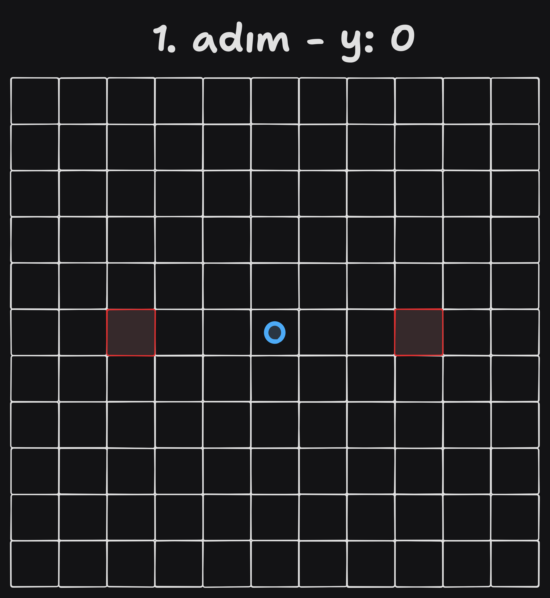
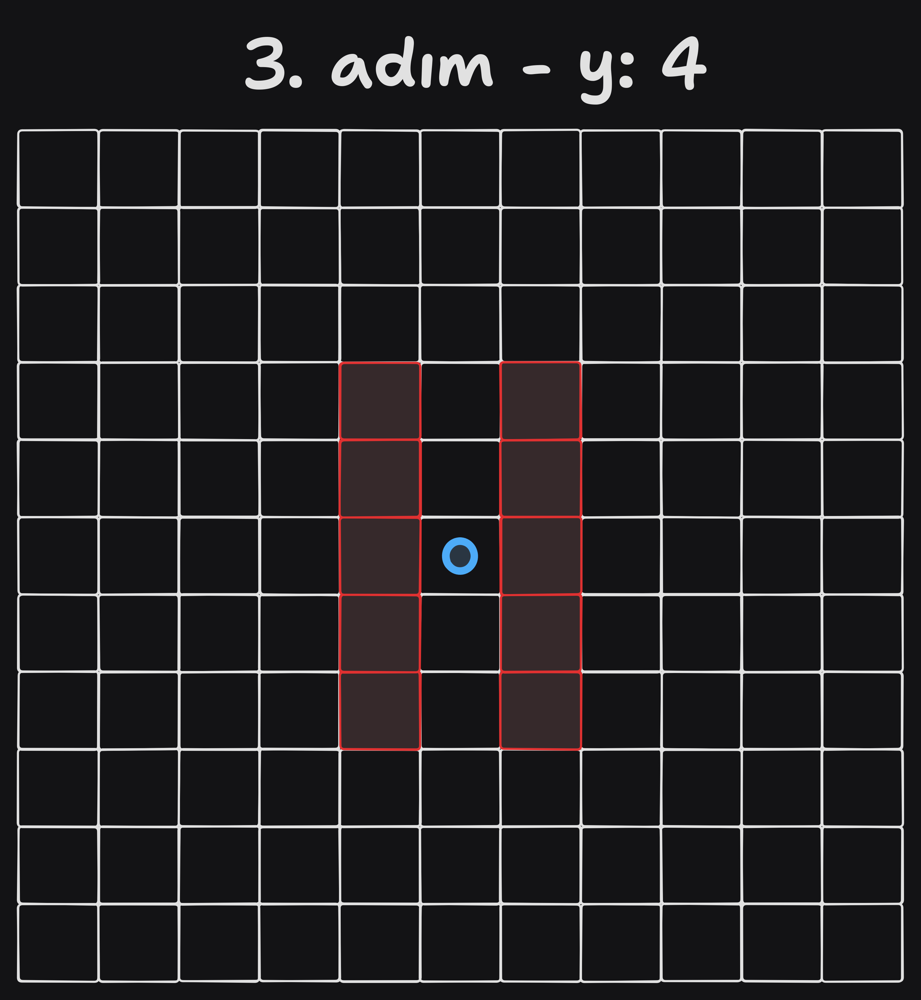
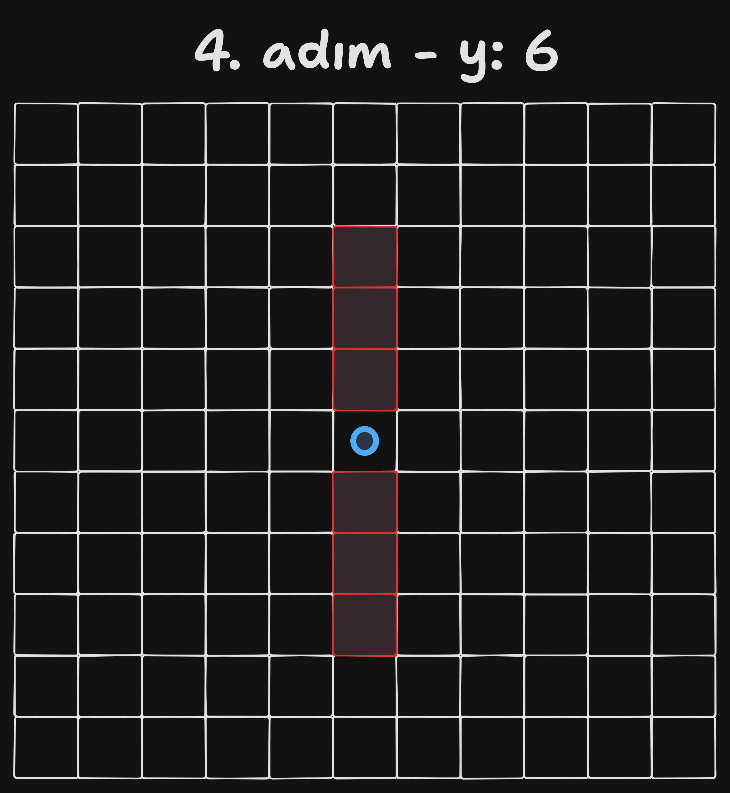
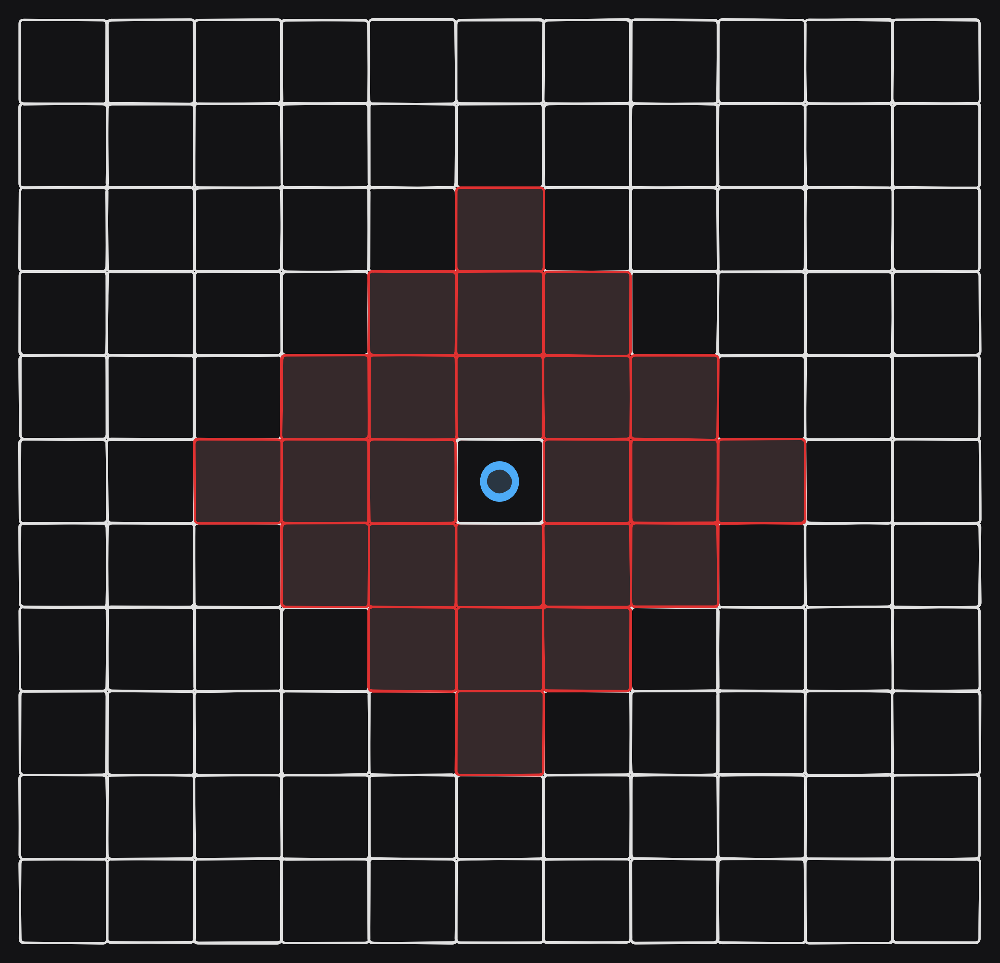

# Av Simülasyonu
Alanın temsili için 2 boyutlu bir `IMover` slice'ı kullanılır. `IMover` alan içindeki her canlı için gerekli olan methodları barındırır. 

```go
type IMover interface {
	Move() (int, int)
	Unit() int
	X() int
	Y() int
	SetX(int)
	SetY(int)
}
```

Bununla birlikte `LivingThing` struct'ı `IMover` interface'ini implemente eder. Bu struct alan içindeki her canlı için gerekli olan methodları ve fieldları barındırır. Alan içindeki her canlı bu struct'ı kapsar.

```go
type LivingThing struct {
	x         int
	y         int
	unitRange int
}
```

Alan içinde toplamda 3 farklı tür vardır; __Hunter__ (Avcı), __Predator__ (Yırtıcı) ve __Prey__ (Kurban). Bu türlerin her biri `IMover` interface'ini implemente eder.

Uygulama içeriside periyodik olarak, sırası ile `Move`, `Breed` ve `Hunt` fonksiyonları çağrılır. Yani; ilk olarak her canlı rastgele bir yöne hareket eder _(eğer rastgele belirlenen konumda başka bir canlı var ise konumu tekrardan hesaplanır)_, `IBreeder` interface'ini implemente eden canlılar ürer ve `IHunter` interface'ini implemente eden canlılar avlanır. 

Alan içerisinde sırayla hareket edilir. Hareket etme öncelikleri şöyledir; `hunter` -> `predator` -> `prey`. Hareketin yönü _(yukarı, sağ, aşağı, sol)_ rastgele belirlenir. `Move` fonksyonu  `IMover.Move` methodu çağrılır, bu method `area` içerisindeki kendi objesinin `x` ve `y` fieldlarını günceller. Daha sonra `area.matrix` üzerinde eski konumu silinir, yeni konuma atama yapılır.

Aynı cins hayvanların 3 birim yakınına gelindiğinde üreme gerçekleşir. `Breed` fonksiyonu `IAnimal` interface'ini implemente eden canlılar için çağrılır. `Breed` methodlarında canlının 3 birim uzaklığı sol ve sağından başlanarak taranır.

Ardından `Hunt` fonksiyonu çağrılır. Bu fonksiyon `IHunter` interface'ini implemente eden canlılar için çağrılır. `Hunt` methodlarında canlının avlayabileceği mesafe içerisindeki canlılar taranır. Eğer avlanma gerçekleşirse avlanan canlı `area.matrix` üzerinden silinir.

> [!CAUTION]
> `Hunt` methodu sonrası `area.matrix` üzerinde silme işlemlerinde sebebini anlayamadığım bir sorun var, uygulamanın ana mantığı üzerinde yoğunlaştığım için sorunu henüz çözemedim. Ama ilgileniyorum 🫠

## Tarama işlemi

|  |  |
|---|---|
|  |  |
|  |  |

Belirli bir konumda, 3 birim mesafe içerisindeki konumlar kırmızı ile gösterilmiştir. Tarama işlemi için ilk olarak __x__ ekseninden 3 birim soldan ve sağdan başlanır. Tarama işleminin her adımında __y__ ekseninden taranacak eleman sayısı 2 artar. Bu 2 elemen o anki taranan __x__ konumunun bir üst ve bir altındaki konumlarıdır. Bu işlem __x__ eksenindeki tarama işleminin, etrafı taranan birimin olduğu konuma gelene kadar tekrarlanır.  

Toplam taranan alan şekildeki gibidir.


Taranan alan içerisinde, kendisi ile aynı tür ve farklı cinsiyetteki hayvanlar, bir slice içerisine eklenir. Daha sonra bu slice içerisinden kendisine en yakın olan hayvan seçilir. Hayvan tipinin kurucu fonksiyonu çağrılarak yeni bir hayvan oluşturulur. Oluşturulan hayvanın konumu rastgele üretilir ve `area.matrix` üzerinde bu konuma atama yapılır.


### Eksikler
- [ ] `Hunt` methodu sonrası `area.matrix` üzerinde silme işlemi düzeltilmeli.
- [x] `Predator` ve `Prey` yapılarında `Breed` methodu, `Hunter` ve `Predator` yapılarında ise  `Hunt` methodu içerisinde tarama işlemi için tekrar eden kod blokları bulunuyor. Bu tarama işlemi için daha generic bir fonksiyon yazılmalı.
- [ ] `Breed` methodu, eşleştiği hayvan daha önce üreme yapmış olsa bile üreme yapabiliyor. Bu durum düzeltilmeli.
- [ ] Logging sistemi kurulmalı

Benim gözümden kaçan eksikler varsa, belirtirseniz sevinirim. 🙏
